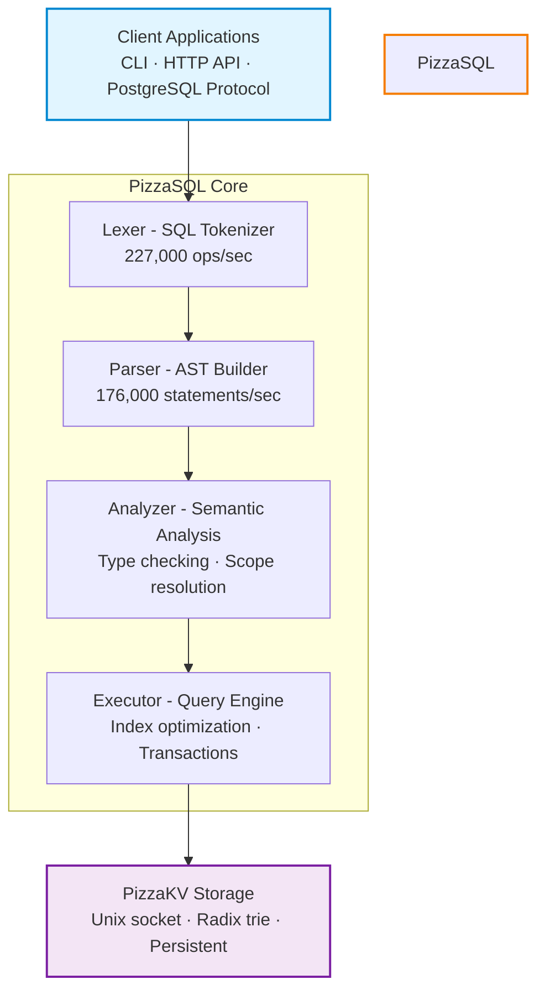

# PizzaSQL

<div align="center">

**A SQL database built from scratch in Go**

SQLite-compatible SQL · PostgreSQL wire protocol · HTTP/JSON API · Built-in storage

[](https://go.dev/)
[]()
[]()

[Features](#features) · [Quick Start](#quick-start) · [Documentation](#documentation) · [Benchmarks](#benchmarks)

</div>

---

## What is PizzaSQL?

PizzaSQL is a SQL database engine built from the ground up in Go. It features a hand-written recursive descent parser, SQLite-compatible SQL syntax, and multiple access methods.

PizzaSQL passes **100% of the SQLite SQLLogicTest suite** — over 5 million individual SQL tests covering edge cases, type coercion, complex queries, and SQLite compatibility.

### Access Methods

- **PostgreSQL Wire Protocol** — Connect with `psql`, any PostgreSQL client library (psycopg2, node-postgres, etc.)
- **HTTP/JSON API** — Query via REST endpoints from any language and the web
- **CLI & REPL** — Interactive shell and command-line execution

### Architecture

- **Hand-Written Lexer & Parser** — Pure Go implementation
- **PizzaKV Storage** — Durable append-only `.pkvdb` backend implemented in Zig
- **PKBFI Transport** — Checksummed binary frames over TCP or Unix domain sockets
- **Thread-Safe** — Concurrent query execution with mutex-based locking

---

## Features

### Core SQL Operations

- Full CRUD: SELECT, INSERT, UPDATE, DELETE
- DDL: CREATE/DROP/ALTER TABLE, CREATE/DROP INDEX
- Joins: INNER, LEFT, RIGHT, FULL OUTER, CROSS
- Aggregation: COUNT, SUM, AVG, MIN, MAX with GROUP BY/HAVING
- Subqueries: Scalar, IN, EXISTS, and correlated subqueries
- Transactions: BEGIN, COMMIT, ROLLBACK, SAVEPOINT
- Advanced SQL: DISTINCT, ORDER BY, LIMIT/OFFSET, CASE expressions

### Multiple Access Methods

**PostgreSQL Wire Protocol**
```bash
# Start server
./pizzasql -kv -pg

# Connect with psql
psql -h localhost -p 5432 -d pizzasql

# Or any PostgreSQL client library
postgresql://localhost:5432/pizzasql
```

**HTTP/JSON API**
```bash
# Start HTTP server
./pizzasql -kv -http

# Query via REST
curl -X POST http://localhost:8080/query \
  -H "Content-Type: application/json" \
  -d '{"sql": "SELECT * FROM users WHERE age > ?", "params": [25]}'
```

**CLI/REPL**
```bash
# Interactive mode with storage
./pizzasql -kv

# Single statement
./pizzasql "SELECT * FROM users LIMIT 10"
```

### SQLite Compatibility

- ROWID Support — Implicit rowid column for all tables
- AUTOINCREMENT — Sequential ID generation
- Type Affinity — SQLite-compatible type system
- PRAGMA Statements — table_info, database_list, table_list, version
- SQLite Functions — printf, hex, random, glob, instr, zeroblob
- Conflict Resolution — INSERT OR REPLACE/IGNORE/FAIL/ABORT

### Performance & Architecture

- Hand-Written Parser — 176,000 statements/sec
- Fast Lexer — 227,000 ops/sec tokenization
- Automatic Indexing — 10-100x faster than full table scans
- Unix Socket Transport — Sub-millisecond KV latency
- Thread-Safe — Concurrent query execution with mutex-based locking
- Connection Pooling — Efficient resource management

---

## Quick Start

### Installation

**Prerequisites:**
- Go 1.21+
- PizzaKV — Storage backend (auto-launched with `-kv` flag)

**Build and install:**
```bash
git clone https://github.com/danfragoso/pizzasql.git
cd pizzasql
make install        # installs to /usr/local/bin
# or
make install PREFIX=~/.local   # user install, no sudo
```

**Build only:**
```bash
make build          # output: ./bin/pizzasql
```

### Start the Server

**Option 1: HTTP API**
```bash
pizzasql -kv -http
# Listening on http://localhost:8080
```

**Option 2: PostgreSQL wire protocol**
```bash
pizzasql -kv -pg
# psql -h localhost -p 5432 -d pizzasql
```

**Option 3: Both at once**
```bash
pizzasql -kv -http -pg
```

**Option 4: Interactive REPL**
```bash
pizzasql -kv
```

The `-kv` flag auto-launches a PizzaKV storage process connected via Unix socket (`.pizzakv.sock` in the working directory). PizzaKV stores data in `.pkvdb` by default. PizzaSQL writes its runtime state to `/tmp/pizzasql/<pid>/runtime.json` and cleans up on exit.

PizzaSQL requires a PKBFI-capable PizzaKV. Existing legacy `.db` files must be migrated once before upgrading. See [`PKBFI_STORAGE_MIGRATION.md`](PKBFI_STORAGE_MIGRATION.md).

### Your First Query

**Using psql:**
```sql
psql -h localhost -p 5432 -d pizzasql

CREATE TABLE users (
  id    INTEGER PRIMARY KEY AUTOINCREMENT,
  name  TEXT NOT NULL,
  email TEXT UNIQUE
);

INSERT INTO users (name, email) VALUES
  ('Alice', 'alice@example.com'),
  ('Bob',   'bob@example.com');

SELECT * FROM users;
```

**Using HTTP API:**
```bash
curl -X POST http://localhost:8080/query \
  -H "Content-Type: application/json" \
  -d '{"sql": "SELECT * FROM users"}'
```

**Response:**
```json
{
  "columns": [
    {"name": "id",    "type": "INTEGER"},
    {"name": "name",  "type": "TEXT"},
    {"name": "email", "type": "TEXT"}
  ],
  "rows": [
    [1, "Alice", "alice@example.com"],
    [2, "Bob",   "bob@example.com"]
  ],
  "rowsAffected": 0,
  "executionTimeMicro": 108
}
```

---

## Process Management

PizzaSQL uses a per-instance runtime directory at `/tmp/pizzasql/<pid>/` to track process state. Each directory contains a `runtime.json` with the PizzaSQL and PizzaKV PIDs and connection info.

```
/tmp/pizzasql/
  12345/
    runtime.json    ← { "pizzasql": { "pid": 12345, ... }, "pizzakv": { "pid": 12346, ... } }
  67890/
    runtime.json
```

**Multiple instances** are supported as long as each runs from a different working directory (each needs its own `.pkvdb` and `.pizzakv.sock` file).

**Stale entries** (from crashed processes) are cleaned up automatically on the next startup.

**Startup prompt** — if another live pizzasql instance is detected you'll see:
```
Warning: 1 pizzasql instance(s) already running:
  PID 12345 http=:8080 kv=unix:.pizzakv.sock
Continue anyway? [y/N]
```

**Connecting to an external PizzaKV** (without `-kv`):
```bash
pizzasql -kvaddr localhost:8085 -http
```

---

## Benchmarks

Performance on an M2 MacBook Air, 10,000-row table, 200 repetitions.

| Workload | SQLite | PostgreSQL | PizzaSQL |
|---|---|---|---|
| Point lookup by PK | 0.003 ms | 0.092 ms | 15.628 ms |
| Category scan (no index) | 0.666 ms | 0.604 ms | 16.080 ms |
| Value range (no index) | 1.531 ms | 1.116 ms | 17.909 ms |
| COUNT(*) | 0.004 ms | 0.305 ms | 15.651 ms |
| Aggregate by category | 2.419 ms | 1.070 ms | 16.667 ms |
| Top-10 ORDER BY DESC | 0.861 ms | 1.020 ms | 21.735 ms |
| **Category scan (indexed)** | 0.537 ms | 0.279 ms | **0.108 ms** |
| Value range (indexed) | 2.456 ms | 0.828 ms | 17.854 ms |

These figures predate the `.pkvdb`/PKBFI storage integration and are retained as a legacy baseline. Current PizzaSQL uses paginated binary scans and versioned binary row tuples; rerun the suite on the target hardware before using these numbers for capacity planning.

### Run Benchmarks

```bash
# Requires PizzaSQL running at :8080 and PostgreSQL at :5432
go run ./cmd/bench/

# Include raw KV benchmark (find the KV port in /tmp/pizzasql/<pid>/runtime.json)
go run ./cmd/bench/ -kvaddr localhost:<port>
```

---

## PostgreSQL Wire Protocol Support

PizzaSQL implements the PostgreSQL wire protocol, allowing you to use any PostgreSQL client with SQLite-compatible SQL syntax.

### Connecting with Client Libraries

**Python (psycopg2):**
```python
import psycopg2

conn = psycopg2.connect(host="localhost", port=5432, database="pizzasql")
cur = conn.cursor()
cur.execute("CREATE TABLE users (id INTEGER PRIMARY KEY AUTOINCREMENT, name TEXT)")
cur.execute("INSERT INTO users (name) VALUES (%s)", ("Alice",))
cur.execute("SELECT * FROM users")
print(cur.fetchall())
conn.commit()
conn.close()
```

**Node.js (node-postgres):**
```javascript
const { Client } = require('pg');
const client = new Client({ host: 'localhost', port: 5432, database: 'pizzasql' });
await client.connect();
await client.query("CREATE TABLE users (id INTEGER PRIMARY KEY AUTOINCREMENT, name TEXT)");
await client.query("INSERT INTO users (name) VALUES ($1)", ['Alice']);
const res = await client.query("SELECT * FROM users");
console.log(res.rows);
await client.end();
```

**Go (lib/pq):**
```go
db, _ := sql.Open("postgres", "host=localhost port=5432 dbname=pizzasql sslmode=disable")
db.Exec("CREATE TABLE users (id INTEGER PRIMARY KEY AUTOINCREMENT, name TEXT)")
db.Exec("INSERT INTO users (name) VALUES ($1)", "Alice")
rows, _ := db.Query("SELECT * FROM users")
```

### Command-Line Tools

```bash
# Interactive
psql -h localhost -p 5432 -d pizzasql

# Single command
psql -h localhost -p 5432 -d pizzasql -c "SELECT * FROM users"

# SQL file
psql -h localhost -p 5432 -d pizzasql -f schema.sql

# pgcli
pgcli postgresql://localhost:5432/pizzasql
```

**DBeaver / DataGrip / pgAdmin:** connection type PostgreSQL, host `localhost`, port `5432`, database `pizzasql`, no credentials.

### Important Notes

1. **SQL Dialect**: PizzaSQL uses **SQLite syntax**, not PostgreSQL syntax
   - Use `INTEGER PRIMARY KEY AUTOINCREMENT`, not `SERIAL`
   - Use `TEXT`, not `VARCHAR` with enforced length
2. **Parameter placeholders**: use `$1, $2...` (PostgreSQL style) or `?` (SQLite style)
3. **No PostgreSQL-specific features**: no schemas, roles, `ARRAY`, `JSONB`, etc.

---

## Architecture



---

## Documentation

### CLI Reference

```bash
# Storage
-kv                  Launch PizzaKV automatically (Unix socket)
-kvaddr string       Connect to existing PizzaKV (e.g. localhost:8085)
-kvflags string      Extra flags forwarded to pizzakv (e.g. "-iwal")
-db string           Database name (default "pizzasql")
-pool int            KV connection pool size (default 5)

# HTTP server
-http                Enable HTTP server
-http-host string    Host (default "localhost")
-http-port int       Port (default 8080)
-http-cors           Enable CORS headers (default true)
-http-compression    Enable gzip compression (default true)
-http-auth           Enable API key authentication
-api-keys string     Comma-separated API keys

# PostgreSQL wire protocol
-pg                  Enable PostgreSQL server
-pg-host string      Host (default "localhost")
-pg-port int         Port (default 5432)

# Export / Import
-o string            Output file (export)
-i string            Input file (import; .db/.sqlite/.sqlite3 auto-imports from SQLite)
-table string        Table name (required for CSV)
-format string       Format: sql, csv, sqlite (auto-detected from extension)
-drop                Include DROP TABLE in SQL export
-create-table        Create table from CSV schema on import
-ignore-errors       Continue import on row/table errors

# Misc
-quiet               Suppress request/query logging
```

### HTTP API

| Method | Path | Description |
|--------|------|-------------|
| POST | `/query` | Execute SQL, return rows |
| POST | `/execute` | Batch statements |
| GET | `/schema/tables` | List all tables |
| GET | `/schema/tables/{name}` | Table schema |
| GET | `/health` | Health check |
| GET | `/stats` | Runtime statistics |
| GET | `/metrics` | Prometheus metrics |
| POST | `/transaction/begin` | Begin transaction |
| POST | `/transaction/commit` | Commit |
| POST | `/transaction/rollback` | Rollback |

**Multi-database:** pass `X-Database: <name>` header to route queries to a specific database. Databases are created on first access.

### Database Export / Import

#### SQL export/import

```bash
# Export full database
pizzasql -db mydb -o backup.sql

# Export with DROP TABLE
pizzasql -db mydb -o backup.sql -drop

# Export single table
pizzasql -db mydb -table users -o users.sql

# Export to CSV
pizzasql -db mydb -table users -o users.csv

# Import SQL
pizzasql -db mydb -i backup.sql

# Import CSV (create table from header)
pizzasql -db mydb -table users -i users.csv -create-table
```

#### SQLite `.db` import

PizzaSQL can import a SQLite database file directly. Tables, indexes, and row data are all imported. Pragmas, views, and triggers are skipped.

**CLI — auto-detected from `.db` / `.sqlite` / `.sqlite3` extension:**
```bash
pizzasql -kv -db mydb -i source.db
```

**Keep going on errors** (e.g. duplicate rows or unsupported DDL):
```bash
pizzasql -kv -db mydb -i source.db -ignore-errors
```

**Insert into an existing database** (skip `CREATE TABLE`, only insert rows):
```bash
# Not yet exposed as a CLI flag — use the HTTP API's create_tables=false parameter
```

**HTTP API — multipart upload:**
```bash
curl -X POST http://localhost:8080/import \
  -H "X-Database: mydb" \
  -F "file=@source.db"
```

**HTTP API — raw body** with explicit format:
```bash
curl -X POST "http://localhost:8080/import?format=sqlite" \
  -H "X-Database: mydb" \
  -H "Content-Type: application/octet-stream" \
  --data-binary @source.db
```

**HTTP API options:**

| Query param | Default | Description |
|---|---|---|
| `format` | auto | `sqlite` forces binary SQLite mode |
| `create_tables` | `true` | `false` skips `CREATE TABLE`, only inserts rows |
| `ignore_errors` | `false` | Continue past individual row/table errors |

**Response:**
```json
{
  "tablesCreated":  ["users", "albums", "tracks"],
  "tablesImported": ["users", "albums", "tracks"],
  "rowsInserted":   27754,
  "indexesCreated": 61,
  "errors": []
}
```

**What gets imported:**
- All tables (schema + data)
- Regular indexes (`CREATE INDEX`)

**What is silently skipped:**
- Pragmas
- Views
- Triggers
- Expression indexes (e.g. `CREATE INDEX ON t(COALESCE(a, b))`)
- `FOREIGN KEY` / `CHECK` constraints (schema is imported without them)
- `AUTOINCREMENT` keyword (not needed — PizzaSQL handles PK generation)

**Supported file detection** (format auto-selection in order):
1. `?format=sqlite` query param
2. Filename extension: `.db`, `.sqlite`, `.sqlite3`
3. Content-Type: `application/x-sqlite3` or `application/octet-stream`
4. Magic bytes: file starts with `SQLite format 3`

### SQL Support

**Data Types:** `INTEGER` (INT, BIGINT, BOOLEAN) · `REAL` (FLOAT, DOUBLE, DECIMAL) · `TEXT` (VARCHAR, CHAR) · `BLOB` · `NUMERIC`

**Joins:** INNER · LEFT · RIGHT · FULL OUTER · CROSS

**Aggregates:** COUNT · COUNT(DISTINCT) · SUM · AVG · MIN · MAX

**Functions:** UPPER, LOWER, LENGTH, SUBSTR, TRIM, REPLACE, CONCAT, ABS, ROUND, CEIL, FLOOR, MOD, COALESCE, NULLIF, IFNULL, printf, hex, random, glob, instr, zeroblob

**Transactions:**
```sql
BEGIN;
UPDATE accounts SET balance = balance - 100 WHERE name = 'Alice';
UPDATE accounts SET balance = balance + 100 WHERE name = 'Bob';
COMMIT;
```

**Indexes:**
```sql
CREATE INDEX idx_users_email ON users(email);
CREATE UNIQUE INDEX idx_users_email ON users(email);
DROP INDEX idx_users_email;
```

**PRAGMA:**
```sql
PRAGMA table_info(users);
PRAGMA table_list;
PRAGMA database_list;
```

---

## Testing

```bash
make test           # all tests
make test-v         # verbose
make test-cover     # coverage report → coverage.html
make test-race      # race detector
make bench          # benchmarks

# Component tests
go test ./pkg/lexer/...
go test ./pkg/parser/...
go test ./pkg/executor/...
```

### SQLLogicTest

```bash
# Run against a live server
make sqllogictest URL=http://localhost:8080

# Quick smoke test
make sqllogictest-basic

# Download full SQLite corpus (~5M tests)
make sqllogictest-download
make sqllogictest
```
